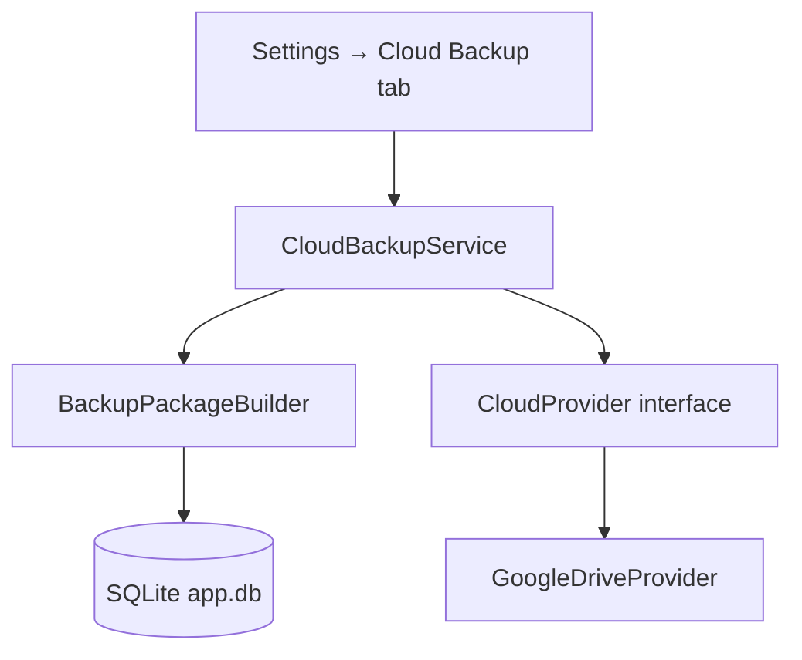

# Cloud Storage MVP — Design (Phase 2)

**Status:** Design approved for implementation  
**Target release:** v1.3.0 (after code quality and performance foundations)  
**Owner:** VoxHash Technologies

## Goals

1. Let users back up and restore application data (SQLite DB + session references) to a cloud provider.
2. Establish a provider abstraction so Google Drive, OneDrive, and Dropbox can be added incrementally.
3. Ship **Google Drive first** as the MVP provider using OAuth 2.0 desktop flow.

## Non-goals (MVP)

- Real-time cross-device sync while the app is running
- Syncing live Telethon `.session` secrets to cloud (sessions stay local; backup stores metadata only)
- Multi-user enterprise tenancy
- Plugin marketplace integration

## User stories

| ID | Story | MVP |
|----|-------|-----|
| CS-1 | Export encrypted backup to cloud on demand | Yes |
| CS-2 | Restore backup from cloud into local app data | Yes |
| CS-3 | List remote backups with date/size | Yes |
| CS-4 | Automatic scheduled cloud backup | No (v1.3.x) |
| CS-5 | OneDrive / Dropbox providers | OneDrive yes (MVP-4); Dropbox post-MVP |

## Architecture

### Modules (proposed)

| Path | Responsibility |
|------|----------------|
| `app/services/cloud/__init__.py` | Public service API |
| `app/services/cloud/provider_base.py` | `CloudProvider` ABC: `authenticate`, `upload`, `download`, `list`, `delete` |
| `app/services/cloud/google_drive.py` | Google Drive API v3 implementation |
| `app/services/cloud/backup_package.py` | Build/verify `.tmas-backup.zip` (DB + manifest JSON) |
| `app/gui/widgets/cloud_backup_widget.py` | Settings UI: connect, backup now, restore |

### Backup package format

- Filename: `telegram-sender-backup-{UTC_TIMESTAMP}.tmas-backup.zip`
- Contents:
  - `manifest.json` — app version, schema version, created_at, checksums
  - `app.db` — SQLite snapshot (via existing `backup_database()` in `app/services/db.py`)
  - Optional `settings-export.json` — non-secret settings only (no API hash in plain text)

Encryption: use existing `app/utils/crypto.py` patterns; user-provided backup password (AES-256-GCM) before upload.

## Google Drive MVP flow

1. User clicks **Connect Google Drive** in Settings.
2. OAuth desktop flow (`google-auth-oauthlib`) stores refresh token in OS keyring or encrypted local store.
3. **Backup now** builds zip → uploads to app folder `Telegram Multi-Account Message Sender/backups/`.
4. **Restore** lists remote zips → download → decrypt → validate manifest → `restore_database()` with confirmation dialog.

### Dependencies (to add in v1.3.0)

- `google-api-python-client`
- `google-auth-oauthlib`
- `google-auth-httplib2`

## Security

- OAuth client ID/secret from user `.env` or built-in public desktop client (document in `docs/configuration.md`).
- Refresh tokens encrypted at rest.
- Backups encrypted with user password; key never uploaded.
- Confirm overwrite before restore; automatic local pre-restore snapshot.

## Settings keys

| Key | Description |
|-----|-------------|
| `cloud_provider` | `none` \| `google_drive` |
| `cloud_auto_backup_enabled` | bool (future) |
| `cloud_last_backup_at` | ISO datetime |
| `cloud_google_connected` | bool |

## Implementation phases

| Phase | Deliverable | Estimate |
|-------|-------------|----------|
| **MVP-1** | `CloudProvider` + backup package builder + unit tests | 1 PR |
| **MVP-2** | Google Drive auth + upload/list/download | 1 PR |
| **MVP-3** | Settings UI + restore flow + docs | 1 PR |
| **MVP-4** | OneDrive provider | Shipped |
| **MVP-5** | Dropbox provider | Future |

## Testing strategy

- Unit tests: package build/verify, manifest validation, provider interface mocks
- Integration tests: mocked Google API responses
- Manual: OAuth on Windows/Linux/macOS, restore on clean profile

## Documentation updates (with implementation)

- `docs/configuration.md` — OAuth setup
- `docs/usage.md` — backup/restore walkthrough
- `ROADMAP.md` — mark Cloud Storage Support **In Progress** when MVP-1 merges

## Open questions

1. Should backups include `recipients` CSV exports for portability, or DB-only?
2. Maximum backup retention count on Drive (default: keep last 10)?
3. Use GitHub Secrets pattern for CI OAuth smoke tests (mock only)?

---

**Next action:** MVP-3 (Settings UI + restore flow + docs) delivered in PR after MVP-2. Future: MVP-4 OneDrive provider.
